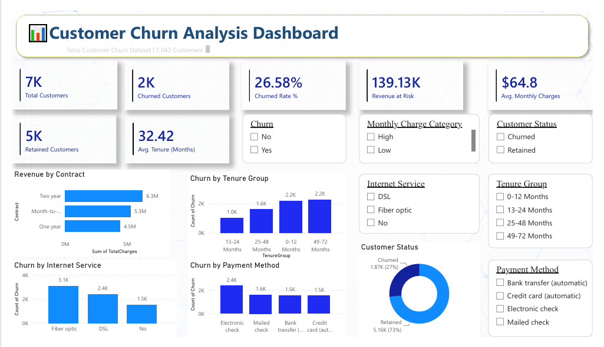

# Customer Churn Analysis using Python (Pandas) & Power BI

## 📌 Project Overview

Customer churn is one of the most important business metrics for subscription-based companies. This project analyzes customer behavior using the **Telco Customer Churn** dataset to identify the key factors contributing to customer attrition.

The project follows a complete end-to-end data analytics workflow:

* Data cleaning using Python (Pandas)
* Exploratory Data Analysis (EDA)
* Exporting a cleaned dataset
* Building an interactive Power BI dashboard
* Generating business insights for decision-making

---

## 🛠️ Tools & Technologies

* Python
* Pandas
* NumPy
* VS Code
* Power BI Desktop
* Power Query
* DAX

---

## 📂 Dataset

**Telco Customer Churn Dataset**

Kaggle Dataset:

https://www.kaggle.com/datasets/blastchar/telco-customer-churn

---

## 📁 Repository Structure

```text
Customer_Churn_Analysis.ipynb
Telco_Customer_Churn_Cleaned_Final.csv
Customer_Churn_Analysis.pbix
Customer_Churn_Analysis.pdf
Customer_Churn_Dashboard.png
README.md
```

---

## 📄 File Description

| File                                   | Description                                                                       |
| -------------------------------------- | --------------------------------------------------------------------------------- |
| Customer_Churn_Analysis.ipynb          | Python notebook containing data cleaning and exploratory data analysis            |
| Telco_Customer_Churn_Cleaned_Final.csv | Final cleaned dataset generated using Pandas and used as the Power BI data source |
| Customer_Churn_Analysis.pbix           | Interactive Power BI dashboard                                                    |
| Customer_Churn_Analysis.pdf            | Exported dashboard report                                                         |
| Customer_Churn_Dashboard.png           | Dashboard preview                                                                 |
| README.md                              | Project documentation                                                             |

---

## 🧹 Data Cleaning

The dataset was cleaned using **Python (Pandas)** by:

* Handling missing values
* Correcting data types
* Cleaning the **Total Charges** column
* Creating customer tenure groups
* Creating monthly charge categories
* Validating data consistency
* Exporting a cleaned dataset for Power BI

---

## 📊 Dashboard KPIs

* Total Customers
* Churned Customers
* Retained Customers
* Churn Rate (%)
* Revenue at Risk
* Average Monthly Charges
* Average Customer Tenure

---

## 📈 Dashboard Analysis

The dashboard provides insights into:

* Revenue by Contract Type
* Churn by Tenure Group
* Churn by Internet Service
* Churn by Payment Method
* Customer Status Distribution

Interactive slicers include:

* Churn
* Customer Status
* Internet Service
* Payment Method
* Tenure Group
* Monthly Charge Category

---

## 💡 Key Business Insights

* Customers on **Month-to-Month** contracts have the highest churn.
* Customers using **Fiber Optic** internet experience higher churn than DSL or customers without internet service.
* **Electronic Check** is the most common payment method among churned customers.
* Customers with shorter tenure are significantly more likely to churn.
* Revenue at Risk highlights the estimated monthly revenue associated with churned customers.

---

## 📷 Dashboard Preview

<p align="center">
  
</p>

---

## 🎯 Project Outcome

This project demonstrates an end-to-end data analytics workflow by transforming raw customer data into meaningful business insights through Python and Power BI. It showcases data cleaning, exploratory analysis, dashboard development, and KPI reporting to support customer retention strategies.

---

## 👨‍💻 Connect With Me

**LinkedIn**

https://www.linkedin.com/in/gunaseelan-s-data-analyst/

**GitHub**

https://github.com/gunaseelan1904
